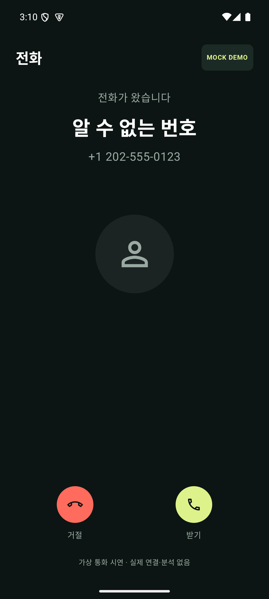
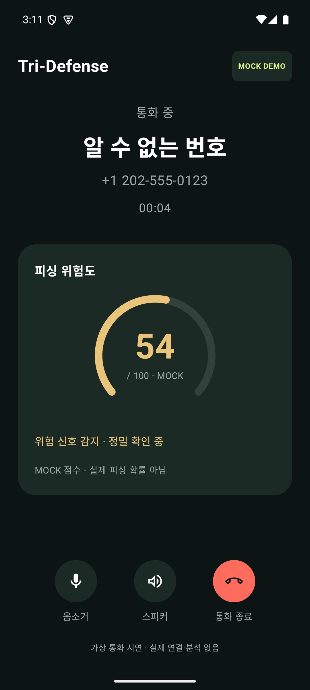
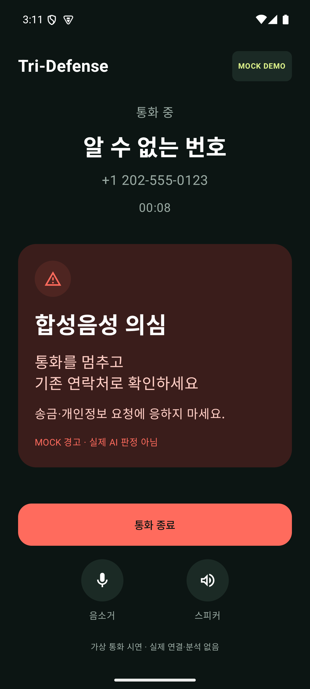
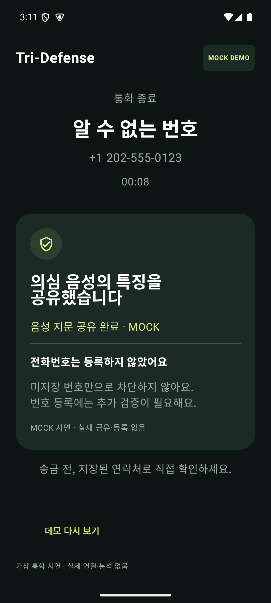

# 자료 삽입용 1–3차 사용자 UI 데모

**사용자 경험 시연 · MOCK** — 실제 전화·AI·블록체인 처리가 아닌 실행 가능한 와이어프레임입니다.

[전체 흐름 영상 MP4](tri-defense-ui-demo.mp4) · [PNG 4장 + 영상 ZIP](victim-ui-assets.zip) · [개발 보고서](../demo-ui-report.md)

| 수신 · 받기/거절 | 1차 · 통화 중 위험 게이지 |
| --- | --- |
|  |  |

| 2차 · 정밀 경고 | 3차 · 공유 결과 |
| --- | --- |
|  |  |

받기 → 0.2초부터 MOCK 게이지 변화 → 정밀 경고 → 통화 종료 → 공유 진행 → 음성 특징 공유 완료. 미저장 번호 사례이며 전화번호는 추가 검증 전까지 등록하지 않은 것으로 표시합니다. 해시·Proof 등 기술 처리 화면이나 수동 등록 버튼은 없습니다.

PPT 권장 캡션: **통화 중 위험을 알리고, 검증된 위협 정보를 공유하는 사용자 경험 · MOCK**.

영상은 무음입니다. 게이지 변화를 녹화하기 위해 캡처 테스트가 작은 시간 간격으로 진행하고 장면별로 잠시 정지합니다. 영상 시간은 실제 AI 지연시간의 측정치가 아닙니다. PNG는 에뮬레이터의 실제 렌더링이며 수신 화면은 시스템 전화 앱이 아닙니다.

```sh
android/gradlew -p android assembleDebug assembleDebugAndroidTest
python3 android/scripts/capture_demo.py --serial emulator-5554
```
