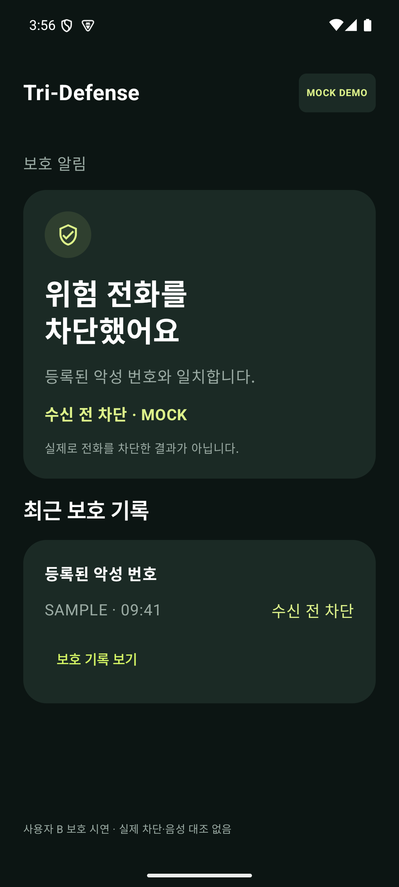
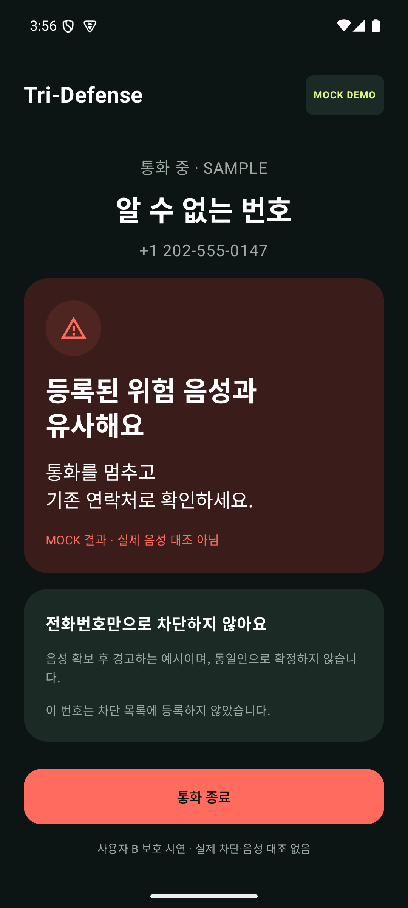

# 사용자 B 보호 경험 — MOCK 콘셉트 UI

기획제안서의 두 보호 경로를 보여주는 Android 화면입니다. **실제 차단·음성 대조 기능을 구현한 것이 아닙니다.** 기존 사용자 A의 수신 → 게이지 → 경고 → 공유 데모와 별도 화면입니다.

| 이미 등록된 악성 번호 | 변경된 새 번호 |
| --- | --- |
|  |  |

- 등록 번호: 별도 검증을 통해 이미 차단 목록에 등록된 가상 번호를 가정합니다. 수신 전 차단 알림과 고정 샘플 보호 기록을 보여줍니다. 받기/거절 화면은 보여주지 않습니다.
- 변경 번호: 통화 음성 확보 후 위험 지문과 유사한 결과가 나왔다고 가정한 경고 화면입니다. 실제 대조나 동일인 확정, 수신 전 차단, 새 번호 자동 등록을 주장하지 않습니다.
- 보호 기록 보기: 고정된 샘플 상세를 펼칩니다. Room 조회나 실제 기록 저장이 아닙니다.
- 통화 종료: 화면 상태만 종료 후 안내로 바뀝니다. 실제 통화를 끊지 않습니다.
- 화면의 MOCK 표시와 실제 동작 없음 문구를 발표자료에서도 유지하세요.

## 실행

Android APK 설치 후:

```sh
adb shell am start -S -n org.tridefense.android/.ui.demo.ProtectionDemoActivity
adb shell am start -S -n org.tridefense.android/.ui.demo.ProtectionDemoActivity --es scenario changed
```

`-S`는 이 앱의 기존 실행을 종료한 뒤 해당 데모 화면을 엽니다. 기본 앱 아이콘은 여전히 사용자 A 데모입니다. 같은 화면에서 시나리오를 고르는 설정을 추가하지 않았습니다.

## 개발·검증

`ui/demo/ProtectionDemoActivity.kt`와 Manifest 진입점, 두 UI 테스트만 추가했습니다. 기존 `DemoTheme`, `DemoCard`, `Action`을 재사용합니다. Backend/Contracts/AI/실제 CallScreeningService는 수정하지 않았습니다. 새 권한·의존성은 없습니다.

```sh
# android/에서 JDK 17 / SDK 35 환경
./gradlew assembleDebug assembleRelease assembleDebugAndroidTest testDebugUnitTest lintDebug
adb shell am instrument -w -r -e class org.tridefense.android.ui.demo.ProtectionDemoTest org.tridefense.android.test/androidx.test.runner.AndroidJUnitRunner
```

다음 단계는 두 콘셉트 화면을 ‘다음 사용자 보호 경험’ 장표에 사용하는 것입니다. 실제 차단이나 지문 대조 연동은 별도 개발 작업입니다. UI 구현 단계에서는 공개하지 않았으며, 이후 제출 정리 상태는 루트 제출 안내 문서를 따릅니다.

## 검증 결과 (2026-09-14)

Debug/release/test APK 빌드 성공, 기존 JVM 테스트 29개 및 사용자 B UI 테스트 2개 통과. Lint 오류 0개, 경고 20개. 네이티브 에뮬레이터 캡처로 제목 줄 간격과 화면 잘림을 점검했습니다.
