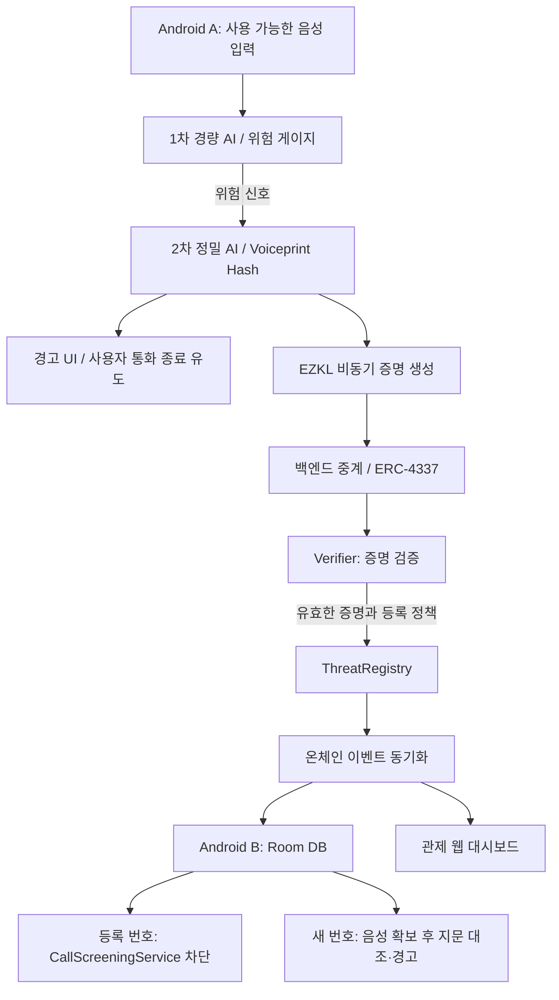

# 구현 명세 (Codex)

> **용도:** Tri-Defense 개발을 Codex에게 맡기기 위한 실행 명세. PPT 원고와 분리한다.
> 이 페이지는 구현 계획이며, 구현 완료를 의미하지 않는다.

기획 기준: [기획제안서 큰 틀](https://app.notion.com/p/3da76637740d80f38d52eaaef1dc3170?pvs=21)

작성 기준일: 2026-09-13. 기존 기획제안서의 목록 1~5 및 본문은 수정하지 않는다.

## 1. 목표와 확정 방향

Tri-Defense: 한 명의 탐지를 다른 사용자의 방어로 연결하는 3단계 딥보이스 방어 네트워크.

- 1차: Android 온디바이스 경량 AI로 위험 점수를 표시한다.

- 2차: 의심 음성의 워터마크·주파수 아티팩트를 정밀 분석하고 Voiceprint Hash를 생성한다.

- 3차: 2차 AI 연산의 zkML 증명을 검증한 뒤 ThreatRegistry에 등록하고 다른 앱에 동기화한다.

- Android / Kotlin, TensorFlow Lite, Python·Librosa·CNN, ONNX·EZKL, Solidity, Base 또는 Arbitrum Sepolia, ERC-4337, CallScreeningService, Room DB를 유지한다.

- 지인 번호 도용·스푸핑 사례는 번호를 등록하지 않는다. 음성 지문만 등록한다.

- 미저장 번호라는 이유만으로 차단하지 않는다. 번호는 별도 검증을 거쳐 블랙리스트로 승격한다.

- 등록된 악성 번호는 수신 단계에서 차단한다. 바뀐 번호는 음성 입력 후 지문 대조·경고로 대응한다.

- 결과물은 Android APK, 테스트넷 컨트랙트, 시연용 관제 웹 대시보드다.

## 2. 명세의 상태와 적용 원칙

기획 확정: 위 1절의 방향과 사용자 시나리오.

개발 기본안: 아래 폴더명·함수명·필드 타입·상태값은 구현 착수를 위해 구체화한 제안이다. 기존 저장소에 대응 구조가 있으면 재사용하고 차이를 기록한다. 새로운 제품 기능을 추가하지 않는다.

선행 검증: 실제 통화 오디오 접근, 지문 재현성, 단말 내 EZKL 실행, 번호 승격 근거는 아직 검증 결과가 없다. 이 부분을 구현 완료로 가정하지 않는다.

문서 간 충돌은 아래 기준으로 처리한다.

- “모든 탐지 번호 등록” 보다 구체적인 “도용 번호 제외·검증 후 번호 승격” 규칙을 따른다.

- “번호 변경 여부와 관계없이 수신 전 차단” 은 구현 조건을 나눈다. 이미 등록된 번호는 수신 전 차단, 새 번호는 음성 확보 후 경고한다.

- zkML 성공은 지정 연산의 무결성 검증이다. 범죄 여부·음성 출처·AI 정확도가 증명되는 것은 아니다.

- 0.1초 동기화와 0.5초 탐지는 목표값으로 관리한다. 측정 전 달성으로 표기하지 않는다.

## 3. 시스템 아키텍처



### 구성 요소별 책임

- Android: 권한·입력 상태 확인, 1차 추론, 위험 UI, 2차 및 증명 작업 연결, Room 동기화, 수신 차단·알림.

- AI: 음성 전처리, 1차 모델 내보내기, 2차 분석, 지문 추출, 검증 데이터셋 평가. Python은 학습·기준 구현 환경이며 Android 배포 방식은 P0에서 검증한다.

- Verification: 2차 모델 ONNX 내보내기, EZKL 설정·회로·키·Verifier 생성, witness·proof 생성과 검증.

- Backend: 제출 검증, UserOperation 중계, 상태 조회, 이벤트 조회. AI 결과를 임의로 생성하거나 proof를 대신 “성공” 처리하지 않는다.

- Contracts: 유효 증명에 결합된 위협 정보 등록·조회, 번호 승격 정책 적용, 이벤트 발행.

- Dashboard: 실제 트랜잭션·이벤트와 동기화 상태 표시. 샘플 모드는 별도 표기한다.

### 두 경로의 분리

현재 통화 대응: 1차 점수 → 2차 분석 → 경고. 증명 생성과 체인 확인을 기다리느라 경고를 늦추지 않는다.

후속 사용자 보호: 비동기 proof → 검증·등록 → 이벤트 → Room 갱신 → 다음 수신 차단.

“분석 완료 / 증명 생성 중 / 제출 중 / 온체인 등록 완료 / 실패” 를 구분한다. 트랜잭션 전송만으로 등록 완료를 표시하지 않는다.

## 4. 구현 전 먼저 확인할 조건

### Android 입력과 권한

일반 앱의 AudioRecord 사용만으로 이동통신 통화 양방향 음성이 확보된다고 가정하지 않는다. VOICE_CALL은 일반 서드파티 앱에 제공되지 않는 CAPTURE_AUDIO_OUTPUT 권한이 필요하다. 대상 기기의 실제 입력 경로부터 검증한다. [Android 공식 문서](https://developer.android.com/reference/android/media/MediaRecorder.AudioSource#VOICE_CALL)

- 입력 어댑터를 LiveAudioSource와 SampleAudioSource로 분리한다. 확보된 샘플 오디오는 초기 통합 검증에 사용한다.

- 실제 통화 입력이 불가능하면 샘플 기반 시연임을 표시하고, 실통화 탐지 완료로 보고하지 않는다. 서버 분석 등으로 제품 구조를 자동 변경하지 않는다.

- TelephonyManager가 임의 VoIP 패킷·스푸핑 헤더를 제공한다고 전제하지 않는다. 번호 검증 상태 등 실제 제공 신호와 미제공 신호를 기록한다.

- CallScreeningService는 5초 안에 응답해야 한다. 수신 시 원격 체인 조회 대신 Room을 조회한다. 역할·권한, 주소록 등록 여부, 번호 비공개 사례를 기기별로 확인한다. [CallScreeningService 공식 문서](https://developer.android.com/reference/android/telecom/CallScreeningService)

### AI와 Voiceprint Hash

- 모든 합성 음성에 워터마크가 있다고 가정하지 않는다. 미검출을 “정상 음성 확정” 으로 처리하지 않는다.

- 원본 오디오 바이트의 단순 해시는 다른 발화·압축·잡음에서 동일 화자를 식별하지 못한다.

- Voiceprint Hash는 기존 기획의 음성 특징 식별값이다. 추출 방법·양자화·직렬화·버전을 고정하고 동일/상이 음성 조건에서 재현성을 검증한다.

- 단순 해시 일치 데모와 번호가 바뀐 실제 통화의 지문 매칭 성능을 구분한다. 미검증 상태에서는 “동일 범인 확정” 으로 표현하지 않는다.

- 입력 길이·샘플링 주파수·모델·위험 임계치는 데이터셋 평가 후 확정한다. 고주파 분석 전에 낮은 주파수로 다운샘플링하여 신호를 버리지 않는다.

### zkML과 번호 등록

EZKL은 모델 연산을 증명하는 도구다. 사용할 ONNX 연산 지원과 단말 실행·메모리·증명 시간을 작은 모델로 먼저 확인한다. [EZKL 공식 문서](https://docs.ezkl.xyz/)

- 승인한 회로·모델과 검증 키를 고정한다. 클라이언트가 임의 Verifier를 선택할 수 없게 한다.

- 등록 riskScore와 Voiceprint Hash를 증명의 공개 출력 또는 검증 가능한 commitment에 결합한다. 단순히 요청 JSON에 나란히 넣는 것은 결합이 아니다.

- 회로 밖 전처리·지문 계산이 있다면 증명 범위 밖임을 명시한다. 결합을 구현하지 못한 필드는 “zkML로 검증됨” 으로 표기하지 않는다.

- zkML 자체는 발신 번호 소유권·스푸핑 여부를 증명하지 않는다. 번호 승격은 별도 근거가 필요하다.

- 실제 번호 승격 기준·검증 주체가 미정이므로 초기 구현은 합성 테스트 번호와 명시적 테스트 근거만 사용한다. 미정인 정책은 운영용 자동 승격으로 배포하지 않는다.

## 5. 저장소와 폴더 구조

단일 GitHub 저장소의 기본안. 기존 저장소가 있으면 먼저 구조·의존성·[AGENTS.md](http://agents.md/)를 읽고 대응 디렉터리를 사용한다.

```text
tri-defense/
  android/                # Kotlin 앱
    app/src/main/         # audio, ai, screening, registry, ui
    app/src/test/
    app/src/androidTest/
  ai/
    preprocessing/
    lightweight/
    precise/
    voiceprint/
    evaluation/
    tests/
  verification/
    models/               # ONNX 또는  다운로드  manifest
    settings/
    scripts/              # compile / witness / prove / verify
    tests/
  contracts/
    src/                  # ThreatRegistry, Verifier adapter
    test/
    script/               # local / testnet deployment
    deployments/          # chainId, address, ABI, block
  backend/
    src/                  # submit, status, registry sync
    tests/
  frontend/               # 시연  관제  대시보드
  shared/
    schemas/              # API·AI 데이터  규격
    fixtures/             # 합성  번호와  재현  가능한  테스트  사례
  docs/
    architecture.md
    api.md
    data-model.md
    decisions.md
    limitations.md
    demo.md
    test-report.md
  .github/
    workflows/
    ISSUE_TEMPLATE/
    pull_request_template.md
  README.md
  .env.example
  .gitignore
```

백엔드·웹 프레임워크는 원문에서 확정되지 않았다. 기존 프로젝트가 없을 경우 Codex가 최소 의존성으로 선택하고 선택 이유·실행 방법을 기록한다. 선택 때문에 기능 범위를 늘리지 않는다.

모델·증명 키·데이터셋은 크기와 라이선스를 확인하고 manifest, 버전, checksum, 재현 절차를 남긴다. 비밀 키·RPC 토큰·실제 통화 녹음·개인 번호를 Git에 넣지 않는다.

## 6. ThreatRegistry 데이터 구조

개발 기본안: 원문의 음성 지문·위험 점수·proof·시각과 조건부 번호 등록을 구조체로 구체화한다. API에서는 큰 정수와 바이트를 문자열로 전달한다.

```solidity
struct ThreatRecord {
    bytes32 threatId;
    bytes32 voiceprintHash;
    uint16 riskScore;       // 0..10000, UI 에서는  /100 %
    uint64 registeredAt;    // block.timestamp
    bytes zkProof;         // MVP 기본안 : 검증에  사용한  증명
}
mapping(bytes32 => ThreatRecord) threats;
mapping(bytes32 => bool) exists;
mapping(bytes32 => bool) usedSubmission;
mapping(bytes32 => bool) blacklistedPhoneKeys;
```

- threatId: 제출 식별자에서 결정적으로 생성한다. 개발안은 chainId·컨트랙트 주소·제출 계정·nonce를 abi.encode 한 뒤 keccak256 적용. 재시도 시 nonce를 재사용한다.

- voiceprintHash: 32바이트. 해시 산출 명세와 버전은 shared 및 모델 manifest에서 고정한다.

- riskScore: 동일 스케일을 AI·proof·API·컨트랙트·UI 전 구간에 적용한다. 모델 점수를 보정하지 않았다면 실제 범죄 확률로 단정하지 않는다.

- registeredAt: 체인 기록 시각이다. 단말 탐지 시각은 성능 로그에 따로 기록하며 신뢰 시각으로 사용하지 않는다.

- zkProof: 원문대로 증명을 등록 데이터와 연결한다. 전체 proof 저장 비용을 측정하고, 저장 대신 트랜잭션 참조·해시만 남기는 변경은 결정 기록 없이 적용하지 않는다.

- phoneKey: 번호 승격 시에만 생성·공개한다. 개발안은 합성 E.164 번호의 canonical 문자열을 keccak256 처리한다. 해시는 번호의 익명성을 보장하지 않는다.

- 지인 도용 사건: 등록 요청·공개 입력·이벤트에 도용 번호나 그 해시를 포함하지 않는다.

- 일반 위협 등록: 번호가 없어도 가능하다. 위협 등록과 번호 블랙리스트 승격을 분리한다.

- 중복 제출은 한 건으로 처리하고 이미 등록한 threatId를 덮어쓰지 않는다. 하나의 지문에 여러 사건이 있을 수 있다.

Room은 위협 지문, 검증 후 승격된 phoneKey, 이벤트 위치를 저장하는 로컬 캐시다. 체인을 진실의 기준으로 삼는다. 이벤트를 chainId·txHash·logIndex로 중복 제거하고 마지막 처리 블록을 저장한다. 재접속 시 빠진 로그를 조회하고 재조직으로 제거된 로그는 되돌리거나 재구축한다.

## 7. AI 모듈 인터페이스

아래는 언어에 독립적인 논리 인터페이스다. Kotlin과 Python 구현은 shared/schemas의 같은 계약을 따른다.

```text
AudioInput {
  sessionId, source: LIVE | SAMPLE,
  samples, sampleRateHz, channels, capturedAt
}
analyzeLightweight(AudioInput) -> {
  sessionId, modelVersion, riskScore: 0..10000,
  needsPrecise: boolean, elapsedMs
}
analyzePrecise(AudioInput) -> {
  sessionId, modelVersion, preprocessingVersion,
  riskScore: 0..10000, voiceprintHash,
  watermarkStatus: DETECTED | NOT_DETECTED | UNSUPPORTED,
  artifactScore, elapsedMs
}
generateProof(PreciseResult, witnessInput) -> {
  proof, publicInputs, circuitVersion, elapsedMs
}
matchVoiceprint(AudioInput, knownVoiceprints) -> {
  matched, matchedHash?, methodVersion, elapsedMs
}
```

- 두 AI 단계는 같은 sessionId로 연결한다. needsPrecise 기준은 버전 관리한 설정에 둔다.

- 길이·채널·값 범위가 잘못된 입력은 오류를 반환한다. 무음·짧은 입력·지원하지 않는 포맷은 정상 판정으로 대체하지 않는다.

- 증명 입력은 2차 실제 계산 결과와 일치해야 한다. 고정 점수나 임의 해시를 실제 분석처럼 반환하지 않는다.

- MATCH 미검증 상태는 미지원으로 반환한다. 임의 유사도·위험 임계값을 팀 확정값처럼 하드코딩하지 않는다.

- SAMPLE / MOCK / REAL_MODEL과 MOCK_PROOF / REAL_PROOF를 별도 메타데이터로 남긴다.

## 8. 백엔드 API와 제출 상태

개발 기본안: 실제 정밀 분석은 온디바이스 목표를 유지한다. 아래 API는 proof 제출과 공유 장부 조회를 담당한다.

- POST /v1/threat-submissions: idempotencyKey, nonce, voiceprintHash, riskScore, proof, publicInputs를 받는다. 응답은 submissionId, status, userOpHash 또는 txHash. 번호는 기본 요청에서 제외한다.

- GET /v1/threat-submissions/{id}: status, txHash, threatId, errorCode 반환.

- GET /v1/registry/events?cursor=...: chainId, blockNumber, blockHash, txHash, logIndex, event, nextCursor 반환. Android·대시보드가 같은 사건을 참조한다.

- GET /v1/registry/threats/{id}: 등록된 위협 조회.

- POST /v1/blacklist-promotions: 합성 테스트 번호의 검증된 승격 요청. 인증된 테스트 검증 주체만 호출하며 일반 사용자 신고만으로 승인하지 않는다.

```text
ANALYZED -> PROVING -> PROOF_READY -> SUBMITTED -> REGISTERED
각  처리  단계  -> FAILED (errorCode 와  재시도  가능  여부 )
```

HTTP 접수 202와 REGISTERED를 구분한다. 입력 오류 400, 권한 실패 401/403, 동일 키·다른 payload 409, proof 또는 정책 불일치 422, 의존 서비스 장애 503을 기본안으로 쓴다. 같은 키·같은 payload는 기존 제출 상태를 반환한다.

백엔드 사전 검증에 성공해도 온체인 검증을 생략하지 않는다. 체인 receipt 실패·드롭·재시도 시 중복 등록하지 않는다.

## 9. 스마트컨트랙트 함수와 이벤트

다음은 논리 ABI 기본안이다. EZKL이 생성한 실제 Verifier ABI는 생성 결과를 읽고 어댑터로 연결한다.

```solidity
registerThreat(
    bytes32 voiceprintHash,
    uint16 riskScore,
    uint256 nonce,
    bytes proof,
    uint256[] publicInputs
) external returns (bytes32 threatId);
getThreat(bytes32 threatId)
    external view returns (ThreatRecord memory);
isBlacklisted(bytes32 phoneKey)
    external view returns (bool);
promoteToBlacklist(bytes32 threatId, bytes32 phoneKey)
    external; // 테스트  검증  주체만 , 실제  정책은  별도  확정
// 앱  내부  공통  어댑터의  논리  시그니처
verifyProof(bytes proof, uint256[] publicInputs)
    external view returns (bool);
event ThreatRegistered(
    bytes32 indexed threatId,
    bytes32 indexed voiceprintHash,
    uint16 riskScore,
    uint64 registeredAt
);
event BlacklistPromoted(
    bytes32 indexed threatId,
    bytes32 indexed phoneKey
);
```

registerThreat 처리 순서: 입력 범위 확인 → 중복·재사용 확인 → 고정 Verifier 검증 → 공개 값과 등록 값 비교 → 위험 기준 확인 → 기록 → 이벤트.

- proof 실패, 점수·지문 불일치, 미지원 회로, 재사용 제출은 revert. 실패 시 상태와 이벤트가 남지 않는다.

- 공개 입력에는 적어도 점수·지문 결합값을 포함한다. replay 방지용 제출 문맥도 증명에 결합되도록 회로/commitment 검증 범위를 설계하고 교차 계정·체인 재사용을 테스트한다.

- 검증 성공은 자동 번호 승격을 뜻하지 않는다. promoteToBlacklist는 존재하는 유효 사건과 별도 번호 검증 근거를 요구한다.

- 테스트용 검증 주체의 계정·근거·제한을 docs에 기록한다. 접근제어는 필요한 구현 상세이며 새로운 사용자 기능이 아니다.

- MockVerifier는 로컬 테스트에서만 사용한다. 테스트넷 최종 시연은 실제 생성 Verifier로 검증한다.

## 10. ERC-4337과 네트워크

Base Sepolia 또는 Arbitrum Sepolia 중 한 곳을 P0에서 선택하고 chainId·RPC·탐색기·배포 블록·주소를 기록한다. 동시 다중 체인 서비스는 범위에 넣지 않는다.

Smart Account → UserOperation → Bundler → EntryPoint → ThreatRegistry로 제출하고 Paymaster가 비용을 후원한다. Relayer API와 Bundler·Paymaster의 책임을 구분한다. [ERC-4337 표준](https://eips.ethereum.org/EIPS/eip-4337)

- 초기 연결 검증은 로컬 일반 트랜잭션으로 할 수 있다. 이를 ERC-4337 구현 완료로 계산하지 않는다.

- 서명 키 보관·계정 생성·후원 한도·실패·재시도를 확인한다. 무제한 공개 후원을 기본값으로 두지 않는다.

- “가스비 1원 미만” 을 고정 사실로 사용하지 않는다. 테스트넷의 gasUsed와 제출·확인 지연을 기록한다.

## 11. 개발 우선순위와 완료 기준

### P0 — 실제 구현 가능성 확인과 최소 연결

1. 저장소·환경: 기존 코드 확인, 폴더·실행 명령·버전·.env.example 구성. 새 환경에서 설치·실행 가능하면 완료.

2. Android PoC: 대상 기기의 입력·역할·권한과 테스트 번호 수신 차단 확인. 실통화 입력 가능/불가능을 증거와 함께 기록.

3. AI PoC: 정상/합성 샘플을 분리한 테스트셋, 전처리, 1차·2차 기준 추론, 지문 재현성 결과 확보.

4. zkML PoC: 작은 2차 모델로 ONNX → EZKL → 실제 proof → 로컬 검증 성공. 잘못된 출력의 검증 실패까지 재현.

5. 장부 연결: 합성 fixture → 등록 → 이벤트 → Room·대시보드에서 같은 threatId 확인. mock 사용 여부를 표시.

P0 완료는 최종 제품 완료가 아니다. Android 입력·단말 증명 생성·지문 매칭 중 미검증이 있으면 항목별로 남긴다.

### P1 — 핵심 기능 통합, 최종 데모 필수

1. 실제 경량 모델·정밀 모델과 Android 위험 UI 연결.

2. 2차 결과와 결합된 실제 proof, 실제 Verifier, ThreatRegistry 등록·거부 경로 구현.

3. 온디바이스 비동기 증명 생성 성능 확인. 불가능하면 목표를 숨기지 않고 팀의 대안 결정이 필요한 항목으로 기록.

4. 도용 번호 제외·검증 번호 승격·Room 동기화·기존 번호 차단·새 번호 경고 연결.

5. ERC-4337 지갑 처리와 Paymaster 후원, 실패 UI 구현.

6. 관제 대시보드에서 이벤트·트랜잭션·등록 상태 확인.

7. 아래 14절의 A → B 시나리오를 재현하고 APK·주소·테스트 결과를 남긴다.

### P2 — 성능·표현·시연 완성도

- p50/p95 지연, 단말 메모리·배터리 부하, 이벤트 재접속 개선.

- 위험 UI·차단 리포트·대시보드 가독성, 발표용 데모·README 정리.

- 원문 대시보드 지도는 신뢰할 위치 데이터가 있을 때만 연결한다. 없으면 미구현으로 남기며 임의 위치를 사실처럼 생성하지 않는다.

P2를 위해 실제 AI·실제 proof·번호 정책 같은 P1 항목을 생략하지 않는다.

### 기존 일정과 연결

신청 전은 P0의 가능한 PoC·설계 증빙, 멘토링은 나머지 P0와 P1, 본선은 P1 통합 검증 및 P2 정리로 배치한다. 각 항목의 상태는 미착수 / 진행 / 검증완료 / 의사결정 필요로 기록하며 날짜가 지났다는 이유로 완료 처리하지 않는다.

## 12. GitHub 운영과 README

### GitHub 구조

- 단일 저장소에서 모듈별 작업 브랜치와 PR을 사용한다. GitHub 저장소 URL은 아직 미정이다.

- 이슈는 P0/P1/P2, 담당 모듈, 입력·출력, 완료 조건, 의존 작업, 검증 결과를 포함한다.

- PR은 변경 동작, 관련 이슈, 실행한 테스트, 미검증 조건, demo/mock 사용 여부를 적는다.

- CI는 계약 테스트, backend/API 테스트, AI 소규모 fixture 테스트, 웹 빌드, Android 빌드·단위 테스트를 분리한다. 고비용 proof·실기기 테스트는 실행 환경과 결과를 별도 기록한다.

- 최종 릴리스에 APK, 체인 주소·ABI, 모델·회로 버전, commit SHA, 데모 안내와 테스트 보고서를 연결한다. 외부 공개 여부는 구현 완료와 별개다.

### README 목차

1. Tri-Defense 소개와 3단계 동작

2. 현재 구현 상태 표: 실제 / mock / 미구현

3. 아키텍처와 폴더 구조

4. 필수 환경·고정 버전·설치

5. 환경변수와 키 설정 예시

6. 로컬 실행 순서: contracts → backend → dashboard → Android

7. AI 모델·데이터셋·EZKL 재현 방법

8. 테스트 실행 및 기대 결과

9. A → B 데모 절차와 초기화

10. 테스트넷 배포 정보·APK·영상

11. 제한사항·미결정 항목·다음 작업

12. 팀 역할과 데이터·모델 라이선스

실행 명령은 실제 구현 후 검증한 명령만 채운다. 설명만 있고 실행되지 않는 명령을 완료 증빙으로 쓰지 않는다.

## 13. 테스트 항목

- AI: 정상/합성 음성, 무음·짧은 입력·잡음·압축·지원하지 않는 포맷, 워터마크 없음, 데이터 분리와 오탐/미탐 결과.

- 지문: 같은 샘플 반복, 같은 화자의 다른 발화, 다른 화자, 코덱·잡음 변화. 단순 해시 일치와 실제 매칭 성능을 분리.

- zkML: 정상 proof 성공, proof 변경·점수 변경·지문 변경·다른 회로 실패, 공개 입력과 등록 필드 일치, 동일 증명 재사용·교차 체인 문맥 검사.

- 컨트랙트: 범위 오류, 중복 제출, 실패 시 이벤트 없음, 도용 번호 미등록, 미승인 승격 거부, 합성 검증 번호 승격·조회.

- API: 잘못된 payload, 동일 키 재시도, 다른 payload 충돌, RPC·Bundler·Paymaster 장애, 접수와 체인 확정 상태 구분.

- 동기화: 중복 이벤트·누락 복구·재시작·재조직 처리, Android와 대시보드의 동일 사건 표시.

- Android: 역할·권한 거절, 주소록 유무, 번호 비공개, 등록/미등록 번호, 오프라인 로컬 조회, 수신 응답 시간, 통화 중 경고와 수신 전 차단 구분.

- 성능: 음성 확보 시간, 1차·2차 추론, proof 생성, 트랜잭션 확인, 이벤트 → Room 각각 측정. 합산 지연을 숨기지 않는다.

테스트 보고서에는 기기·OS·모델/회로 버전·샘플 수·실행 날짜·commit·측정 결과·실패와 제한을 적는다. 이 문서 작성 시점에는 테스트를 실행하지 않았다.

## 14. 최종 시연과 완료 판정

### 시나리오 A — 최초 탐지부터 다른 사용자 보호

1. A에 정상 샘플 입력 → 불필요한 온체인 등록 없이 점수 확인.

2. A에 합성 샘플 입력 → 1차 위험 표시 → 2차 정밀 분석·경고.

3. 실제 proof 생성 → 온체인 검증 → threatId와 트랜잭션 확인.

4. B의 Room과 대시보드에 같은 위협 정보 반영.

5. 별도 검증한 합성 번호를 승격 → B에서 해당 번호 수신 차단·리포트.

### 시나리오 B — 지인 번호 도용·새 번호

도용 번호 없이 지문만 등록 → 지인의 정상 번호가 블랙리스트에 없는지 확인 → 새 번호에서 확보한 음성을 대조하고 경고. 음성 입력 전 차단으로 시연하지 않는다.

### 시나리오 C — 조작된 제출

등록 점수 또는 proof를 바꿔 제출 → 컨트랙트 거부 → B 캐시·대시보드에 유효 위협으로 추가되지 않음.

최종 완료 조건: 실행 가능한 APK, 실제 테스트넷 Verifier·ThreatRegistry, 실제 이벤트를 표시하는 웹 화면, 재현 가능한 README·테스트 보고서. 샘플 입력이나 외부 개발 환경에서의 증명 생성이 남으면 그 범위를 명시하고 실통화·온디바이스 구현 완료와 구분한다.

## 15. 구현 범위와 제외 범위

### 포함

기존 3단계 방어, 두 AI 단계, Voiceprint Hash, zkML, ThreatRegistry, 조건부 번호 승격, Android 수신 차단·경고, Room 동기화, ERC-4337, 단일 L2 테스트넷, 관제 대시보드.

### 제외

iOS, 통신사 망 자체 차단, 모든 통화앱·기기의 오디오 자동 확보, 통화 중 강제 종료 보장, 전세계 전체 앱 자동 연동, 다중 체인 동시 운영, 메인넷 실서비스 운영, 새로운 토큰·보상·거버넌스·신규 제품 기능.

### 결정이 필요한 항목

- 대상 Android 기기·OS와 실제 음성 입력 경로

- 1차·2차 모델·데이터셋·샘플링·위험 기준과 지문 방식

- 단말 정밀 추론·EZKL 실행 가능성 및 허용 지연

- 실제 번호의 승격 근거·검증 주체·오등록 정정 방식

- 선택 테스트넷·AA 제공자·GitHub 저장소

이 항목은 독립적인 P0 구현을 막지 않는다. 의존 기능을 실제로 배포하거나 정책을 확정해야 할 때 근거와 선택지를 정리한다.

## 16. Codex에게 붙여 넣을 작업 지시

> 이 ‘구현 명세 (Codex)ʼ를 기준으로 Tri-Defense를 구현해 줘. 먼저 기존 저장소와 [AGENTS.md](http://agents.md/)를 읽고 현재 구현 상태를 명세와 대조해 줘. 기존 기획제안서는 수정하지 마. P0 부터 실제 코드를 작성하고 실행·테스트한 뒤, 의존성이 해결된 P1을 이어서 구현해 줘. 원래의 Android·2단계 AI·zkML·ThreatRegistry·ERC-4337 방향을 유지해 줘. 함수명·폴더 등 개발 기본안은 기존 코드에 맞춰 조정하고 결정 기록을 남겨 줘. 실제 통화 입력, 단말 증명 생성, 지문 매칭, 번호 승격 정책은 검증 없이 가능하다고 가정하지 마. mock과 실제 구현을 구분하고, 테스트넷 최종 경로에는 실제 모델과 실제 Verifier를 사용해 줘. 각 단계마다 변경 내용, 실행 방법, 검증 결과, 남은 제약을 README와 docs에 기록해 줘. 최종적으로 APK·컨트랙트 주소·대시보드·A → B 시연 절차를 제공해 줘.

<!-- 원문 PDF: de9307d9-c694-47f2-84b0-28e0619ea6c1_구현_명세_(Codex).pdf; SHA-256: ce1692eda6304a5cda215d326d9aa1a24efe7d0555889ad694f802e935124a0b
원문 1쪽 바닥글: 구현 명세 (Codex) 1
원문 2쪽 바닥글: 구현 명세 (Codex) 2
원문 3쪽 바닥글: 구현 명세 (Codex) 3
원문 4쪽 바닥글: 구현 명세 (Codex) 4
원문 5쪽 바닥글: 구현 명세 (Codex) 5
원문 6쪽 바닥글: 구현 명세 (Codex) 6
원문 7쪽 바닥글: 구현 명세 (Codex) 7
원문 8쪽 바닥글: 구현 명세 (Codex) 8
원문 9쪽 바닥글: 구현 명세 (Codex) 9
원문 10쪽 바닥글: 구현 명세 (Codex) 10
원문 11쪽 바닥글: 구현 명세 (Codex) 11
원문 12쪽 바닥글: 구현 명세 (Codex) 12
원문 13쪽 바닥글: 구현 명세 (Codex) 13
원문 14쪽 바닥글: 구현 명세 (Codex) 14
-->
