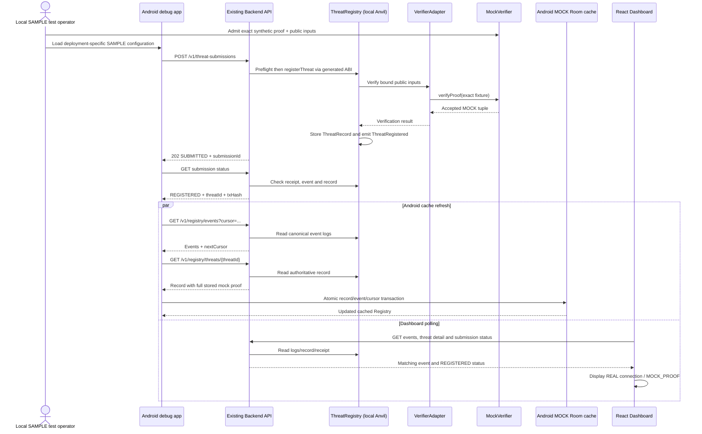

# Integration P0 report

Date: 2026-09-13 (Asia/Seoul)

**Status: COMPLETE for the requested local MOCK integration.** Android → Backend → ThreatRegistry → Event Stream → Dashboard and Android Room were executed using a real Android emulator and browser. This is not completion of the full Tri-Defense MVP.

## Scope and architecture review

Read AGENTS.md, README.md, [implementation specification](implementation-specification.md), and [architecture review](architecture-review.md) before implementation. The latter is a historical scaffold review; this report records the current integration milestone. The implementation specification and proposal were not modified.

| Module | Reviewed current state | Integration P0 action | Remaining gap |
| --- | --- | --- | --- |
| Android | Kotlin application, isolated audio/AI interfaces, Room, protected CallScreeningService, placeholder UI/DI | Added debug-only local HTTP submission/status/events/record client and MOCK integration controls; atomic event ingestion and Room migration | No actual detection, background sync, number promotion or blocking; release app remains a preparation scaffold |
| AI | preprocessing/lightweight/precise/voiceprint/evaluation responsibility folders, no inference implementation | None; all input is labelled SAMPLE | Models, dataset validation, deployment and score/hash generation not implemented |
| Backend | Existing WSGI REST API, SQLite submission journal, receipt-backed status, generated-ABI Registry client and event cursor | Existing runtime reused unchanged by device/browser harness | Local chain/unlocked sender only; no production relay, account abstraction or public deployment |
| Contracts | ThreatRegistry, immutable VerifierAdapter, exact-fixture MockVerifier, scripts, generated ABI and unit tests | Existing contracts deployed by test setup; no contract code changes this task | No real zkML verifier, keys, witness or proof generation |
| Dashboard | React + Vite, read-only API, cursor polling, detail/status panels, separate fixture mode and provenance labels | Existing runtime reused unchanged; added cross-module browser assertion script | No deployment or full chain index; foreground session view only |
| Shared | DTO/schema/constants/API role folders; no generated cross-language DTO package | Documented local fixture configuration and links to existing API/contract definitions | Contract generation/versioning remains future work |
| Docs | Source-of-truth specification, historical architecture review, per-module reports | Updated current READMEs; added this report, Mermaid sequence and reproducible integration instructions | Earlier milestone reports remain historical, not current capability claims |
| Verification / ERC-4337 | No working real verification or AA path | Intentionally untouched and excluded | Separate PoC gates under the full specification |

Architecture decisions were stated before applying: the missing runtime connection was Android HTTP → Room; use a debug-only control screen and existing API endpoints, with fixture admission confined to the local test harness. No API invention, chain redesign or Dashboard business logic was needed.

The additional top-level `integration/` folder contains test orchestration only. Contracts, Backend and Dashboard retain their existing runtime responsibilities. The host's fixture administrator role never becomes an Android or Backend API capability.

## Implemented connection

Android loads a deployment-specific SAMPLE fixture and sends the exact existing six-field submission payload. Backend validates and relays with the generated ABI. ThreatRegistry still calls VerifierAdapter; MockVerifier accepts only an explicitly admitted test tuple. The receipt and emitted event establish registration status. No application treats an accepted POST alone as a confirmed registration.

Android polls existing event pages, queries each referenced authoritative Registry record, compares event identity/content, and writes records, deduplicated events and opaque cursor in one Room transaction. A conflicting record fails without advancing the cursor. Network failure preserves cache without claiming it is current. A cursor reorg/domain invalidation clears the cache; another refresh rebuilds it. The same foreground flow refreshes after submission; a separate refresh button is available.

Room schema 2 adds deployment address and the opaque Backend cursor, with a data-preserving 1→2 migration. The debug fixture database is separate from the default CallScreeningService cache. MOCK records do not activate call blocking. No raw audio or telephone identifier enters the mock submission.

Dashboard uses its existing **Backend API** mode, polling the existing Event API rather than its independent frontend Mock fixtures mode. Transport is labelled REAL while verification remains MOCK_PROOF and LOCAL_TRANSACTION.

## Sequence diagram



Backend preflight also invokes the verifier through an EVM call. It does not bypass the verifier on transaction submission. The mocked item is proof assurance, not HTTP delivery, EVM execution, event emission, browser rendering or Room persistence.

## How to run and test

See [integration/README.md](../integration/README.md) for SDK/emulator setup, explicit device selection, fixture lifecycle, ports and cleanup. It documents that the disposable test app data is cleared.

From repository root with module dependencies installed and JAVA_HOME/SDK/Node/pnpm configured:

```sh
android/gradlew -p android assembleDebug assembleDebugAndroidTest assembleRelease testDebugUnitTest testReleaseUnitTest lintDebug
backend/.venv/bin/python -m unittest discover -s backend/tests
.tools/forge test
pnpm --dir dashboard test
pnpm --dir dashboard build
backend/.venv/bin/python integration/run.py --device emulator-5554 --serve
```

Keep the last command alive; start `pnpm --dir dashboard dev` in another terminal, then run:

```sh
backend/.venv/bin/python integration/verify_dashboard.py
```

The browser script is a separate required check; a host-only API test or Android-only PASS does not complete this integration scenario. The generic Android connected-test task skips the fixture-dependent test without arguments; `run.py` supplies the arguments and requires successful instrumentation plus matching stored evidence.

## Verification results

| Check | Result |
| --- | --- |
| Android debug APK, test APK, unsigned release APK | PASS |
| Android JVM/Robolectric | Debug: 29 passed, including 4 new integration/migration tests; release: 25 passed |
| Android API-35 arm64 emulator | 1 instrumentation integration test passed, actual button → HTTP → Room |
| Backend regression | 21 passed; preserved legacy Python model tests: 11 passed |
| Contracts | 29 passed |
| Dashboard unit tests | 17 passed |
| Dashboard Vite production build | PASS |
| Actual browser integration | PASS: event, record, submitted ID, transaction hash, status and proof provenance |
| Browser console / Vite overlay | No errors detected |
| Android lint | 0 errors, 19 warnings; existing deprecations plus debug UI hardcoded text/input/accessibility/localization warnings |
| Release APK permissions | No INTERNET permission; debug HTTP code excluded from release |

New Android tests verify duplicate-page idempotency and preserved proof/cursor; mismatch rejection without cache advancement; outage preservation versus reorg invalidation; and actual migration from exported schema 1 to schema 2 while preserving records. Existing Backend/Contract tests continue covering verifier rejection, binding, duplicate submissions and receipt/cursor behavior.

The device integration test drove the Android UI instead of posting from Python. Host assertions then compared actual receipt success, one emitted event, the API record, and one Android cached threat/event. Browser assertions compared the same identifiers rendered by Dashboard.

Recorded run evidence (ephemeral local chain, not a public deployment):

- Chain: `31337`; Registry: `0x9fE46736679d2D9a65F0992F2272dE9f3c7fa6e0`.
- Submission: `7087e97c-ba46-4dad-8d38-01d9666fe6d2`.
- Threat: `0xa4aa218f504edf46cd26bb3762a226899464f2ef12471a80afee0fc96708e118`.
- Transaction: `0x9dedc1c99faed95591435cf32b02391d64e8e1d20a635a3b4ffbdfa9a1836f36`.
- Event: `ThreatRegistered`, block `5`, log index `0`; Room threat/event counts `1 / 1`.
- Full mock proof preserved: 29 synthetic bytes, explicitly not zkML.

Ignored `integration/out/` holds the generated fixture, instrumentation log, JSON evidence, browser assertion output and screenshot. These files are regenerated by the scripts. Identifiers above document the verified run and are not reusable configuration.

## Remaining blockers and recommended order

There is no remaining blocker for this requested local MOCK path. The following block the **full specification**, and are not implemented here:

1. **Android / AI / Verification P0 evidence:** validate actual device audio/role constraints; separately complete real model and zkML PoCs, measured accuracy/latency and real input/output binding. No sample RiskScore or VoiceprintHash can satisfy these gates.
2. **Contracts + Verification:** integrate a real generated verifier only after the circuit/public-input contract is established and tested. MockVerifier cannot establish threat validity.
3. **Shared + Backend + Android integration:** reconcile versioned wire contracts, add durable background catch-up and device reconnect coverage, then test real proof submission. Current synchronization is debug foreground/manual and capped per operation, not a persistent worker.
4. **Android protection policy:** validate conditional number promotion, contacts/spoofing/private-number behavior, and physical-device screening deadlines. The current service allows all calls and the separate MOCK cache must not become a protection claim. Two physical users and real telephony were not tested.
5. **ERC-4337 / testnet deployment:** separate approved work for signing, bundler/paymaster and supported network. Local unlocked Anvil transactions do not implement account abstraction.
6. **Dashboard and operational validation:** exercise the future real deployment and failure modes; keep REAL transport distinct from actual proof assurance. No production availability, authentication or indexing claim is made.

Immediate next suggested task: review and approve this report and choose the next outstanding P0 PoC gate. Stop here before real AI, zkML, ERC-4337 or P1/P2 work.

Implementation notes follow Android's documented [Room asynchronous DAO](https://developer.android.com/training/data-storage/room/async-queries) and [network security configuration](https://developer.android.com/privacy-and-security/security-config) mechanisms. Project-pinned Room 2.7.1 and Android API 35 were used and verified locally.
